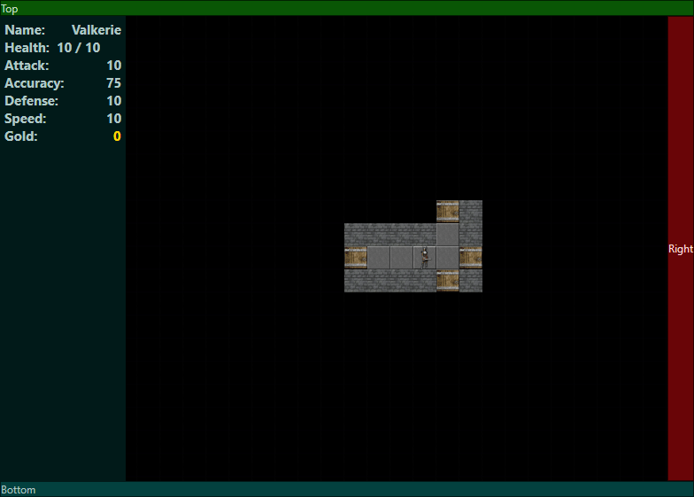

# InventionHack
The C# Roguelike built on top of the [Invention API](https://gitlab.com/hodgskin-callan/Invention)  by Callan Hodgskin and [RogueSharp](https://github.com/FaronBracy/RogueSharp) by FaronBracy.
## The Mission
Use the Invention API to create a basic roguelike with all the features of the [Roguesharp C# tutorial](https://roguesharp.wordpress.com/) and put it on github with an MIT license as a jumping off point for aspiring roguelike creators. Primarily those on [r/roguelikedev](https://www.reddit.com/r/roguelikedev/).

## Features

 - Basic roguelike gameplay
 - Line of site
 - Random floor creation
 - Basic combat
 - Speed system
 - RDBMS style ECS system
 - UI is loosely coupled to the underlying game engine
 - Builds with the dotnet.exe command
 - Not too buggy!
 - Invention is a very good UI engine and the starter game only scratches the surface of whats possible with it.

## Cloning, Building and running in Windows 10
There may be other valid ways to build this.
#### Pre-Reqs

 - Visual Studio 2017/2019 community edition
 - Git
 - [Dotnet 4.6 developer pack](https://www.microsoft.com/en-us/download/details.aspx?id=53321)
 - Optional: [Visual Studio Code](https://code.visualstudio.com/)

#### Clone

Change to a directory where you like to clone stuff.

    C:\local> git clone https://github.com/dustinandrews/InventionHackSharp.git
    C:\local> cd InventionHackSharp
    
    
#### Build and test
If you are building from the command line in Windows these commands should work. If you wish to build for Android, swap in the MegaDungeon.sln.Android file for the MegaDungeon.sln and build from Visual Studio. You will need Xamarin correctly installed. You can also build for iOS.

    C:\local\InventionHackSharp>dotnet build
    ...
    C:\local\InventionHackSharp\bin\Debug\EntityComponentSystemCSharp\net4.6.1\EntityComponentSystemCSharp.dll
    Engine -> C:\local\InventionHackSharp\bin\Debug\Engine\net461\Engine.dll
    Portable -> C:\local\InventionHackSharp\bin\Debug\Portable\net461\Portable.dll
    InventionUiWpf -> C:\local\InventionHackSharp\bin\Debug\InventionUiWpf\net461\InventionUiWpf.exe
    
    Build succeeded.
        0 Warning(s)
        0 Error(s)
        
    PS C:\local\InventionHackSharp> .\runtests.ps1
      NUnit Console Runner 3.10.0 (.NET 2.0)
      Copyright (c) 2019 Charlie Poole, Rob Prouse
      Sunday, November 17, 2019 6:47:32 PM

      Runtime Environment
         OS Version: Microsoft Windows NT 10.0.17763.0
        CLR Version: 4.0.30319.42000

      Test Files
          bin\Debug\Engine\net461\Engine.dll
          bin\Debug\EntityComponentSystemCSharp\net461\EntityComponentSystemCSharp.dll
          bin\Debug\FeatureDetector\net461\FeatureDetector.dll

      Test Run Summary
        Overall result: Passed
        Test Count: 34, Passed: 34, Failed: 0, Warnings: 0, Inconclusive: 0, Skipped: 0
        Start time: 2019-11-18 02:47:32Z
          End time: 2019-11-18 02:47:35Z
          Duration: 2.463 seconds

#### Run the game
    C:\local\InventionHackSharp\bin\Debug\InventionUiWpf\net461\InventionUiWpf.exe

## Tour
If you think this is cool and want to fork the repo to create your own roguelike please help yourself! Here is a brief description of the projects inside.
#### Engine
This is the game logic. It manages the game turns, maps and sits on top of the ECS. It also manages player specific stuff.
#### EntityComponentSystemCSharp
This is the Entity Component System that drives the game. Components are bare-bones C# classes with zero or more data members. The game engine calls every system for every entity each turn and gives it an opportunity to act. Systems filter for appropriate entities and change the data as appropriate.

### FeatureDetector
Reads dungeon maps and flags walls and candidate locations for doors. It relies on [NumSharp](https://github.com/SciSharp/NumSharp) and uses a convolution filter. NumSharp is the C# port of numpy from Python. Things that are a breeze and super fast with numpy can be a downright chore in C#. NumSharp is still in beta and it shows. I plan to extend the convolution filter for use in cellular automata level generation at some point.

### InventionUiWpf
This is the Windows WPF project that makes the UI work on that platform. Right now it's the only supported platform, but the other ones shouldn't be too hard to get working. I want to keep compatibility with dotnet.exe and vscode, so I haven't tried to integrate them.

### lib
This is a custom build of the Invention API for x64 since the current nuget packages were x86 and vscode can only debug x64 binaries.
### Portable (AKA the Portable UI)
This is the platform agnostic UI code that displays the game and ties the user to the engine.

## Pull requests
I am happy to recieve any pull requests and consider them. As the point of this repository is to be a clean starting point, new features are (probably) not going to be added. Any pull requests should:

 - Fix a bug
 - Make the code cleaner and easier to understand
 - Add unit tests that will either help downstream authors, be explanatory code, or both
 - Anything else that makes this a better starting point without making it too complex.

## Various Provisos, Quid pro quo and Caveats
 - Projects build .net 4.6.1 binaries.
 - There is no sound support in the custom Invention binaries as they require a third party library that requires licensing.
 - "dotnet.exe build" and "dotnet.exe test" must continue to work for pull requests to be accepted.
 
## Getting Help
The primary help channel is [r/roguelikedev](https://www.reddit.com/r/roguelikedev/). Use the [announcement thread](https://www.reddit.com/r/roguelikedev/comments/ds3n8y/inventionhacksharp_the_basic_windows_c_roguelike/) or tag u/madsciencestache. For Invention help the Invention channel on the [Pathos](https://pathos.azurewebsites.net/) Lounge discord is a good place or tag u/callanh on Reddit.

## TODO:

 - Consider changing the MegaDungeon namespaces. (MegaDungeon is my own fork where I will develop my unique game.)
 - ~~Remove NumSharp since it's incomplete and much slower for this use than plain C#.~~ Done!

## Change-log:
    11/17/2019 - Callanh has upgraded the Invention nuget to support this project! Accepted pull request and added some multi-targeting to keep Nunit tests working since it doesn't support netstandard yet.

## Backstory
After stumbling on [Pathos](https://pathos.azurewebsites.net/) the Nethack Reboot I learned that the author, Callan Hodgskin, built it on top of a code-first API capable of building for Windows, iOS, Android and Linux. I checked out the API and found it to be excellent. It re-ignited my desire to create a roguelike. I also want to promote Invention as a platform, so I created this repository as a basic starting point for roguelike developers who want to program in C#.
